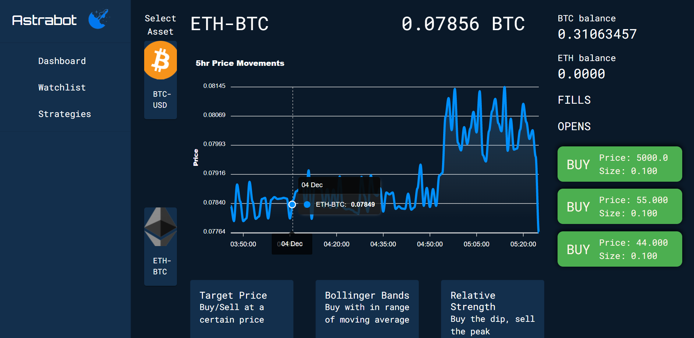
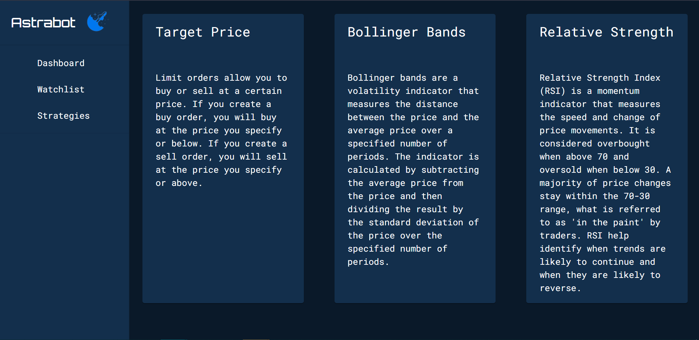

# SkyRo Crypto Bot

# Objective

Create a crpyto trading bot that executes trades at a desired price.

Add additional strategies continuous strategies that can trade crypto based on technical analysis

[Hosted application](137.184.56.247)

# Project Architecture

The project uses Model View Presenter (MVP) as an architecture. Model View Presenter is characterized by the UI elements creating events, the presenter handling those events, and manipulating the model. The controllers on the backend handle most communication with the model and are responsible for relaying updates to the view

# API Documentation

## Get Balance For Current currencies

### Route: user/account

This endpoint gets the account balances for the current crypto market passed into it. It takes the product_id of a market (BTC-USD) then splits it on the dash and returns the current profile's account balance for the two currencies. For example,  if it receives the product_id of BTC-USD it will return the account balances for the base currency (BTC) and the quote currency (USD).

Payload: product_id

Response: { baseBalance: 123454.84, quoteBalance: 123435.86 }

# Screens

## Dashboard

The dashboard is where the magic happens. It's here that you can start strategies, wait for the strategy to accumulate data, and let the algorithm buy for you. It uses WebSockets to get real-time updates whenever a buy or sell is made.

## Watchlist

The watchlist allows you to pick from a particular product you want to keep an at and get a glance at its chart data.

## Strategies

The strategies page briefly explains what strategies are being implemented by the bot and the methodology behind them. The target price strategy lets you place an order that will fill whenever that price is reached. Bollinger bands keep track of a moving average and buys/sells when the price moves out of that range. The Relative Strength Index is a trend analysis that keeps track of when trends are beginning to reverse, essentially buying the dip and selling the peak.

# Installation

To use this app you will need to create an account at the Coinbase Pro Sandbox

Clone this app to your local computer and cd into the root folder for this project

Then cd into your client folder and run

`cd client && yarn install`

Then cd back out of that folder

`cd ..`

And install the libraries for the server using

`cd server && yarn install`

Then when you're ready to startup either the client or server run:

`yarn dev`

